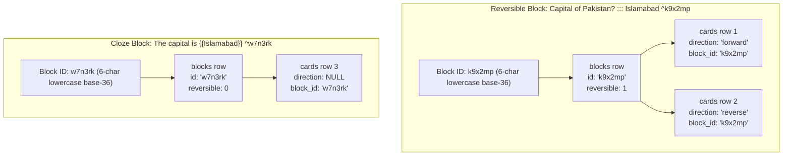
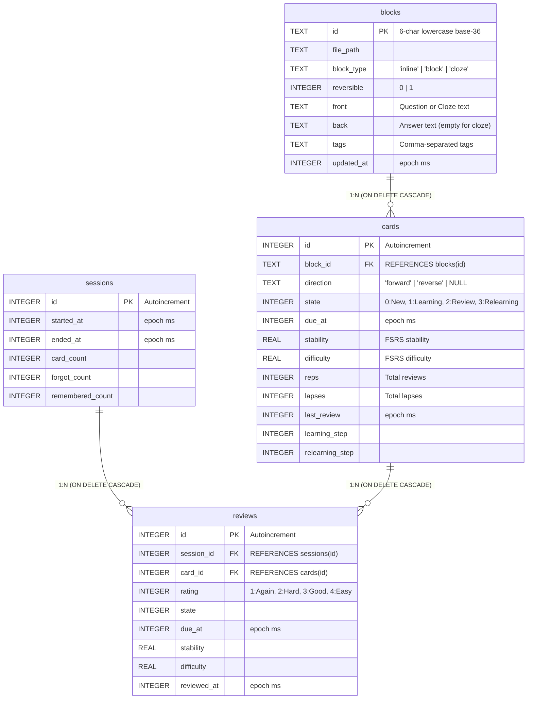
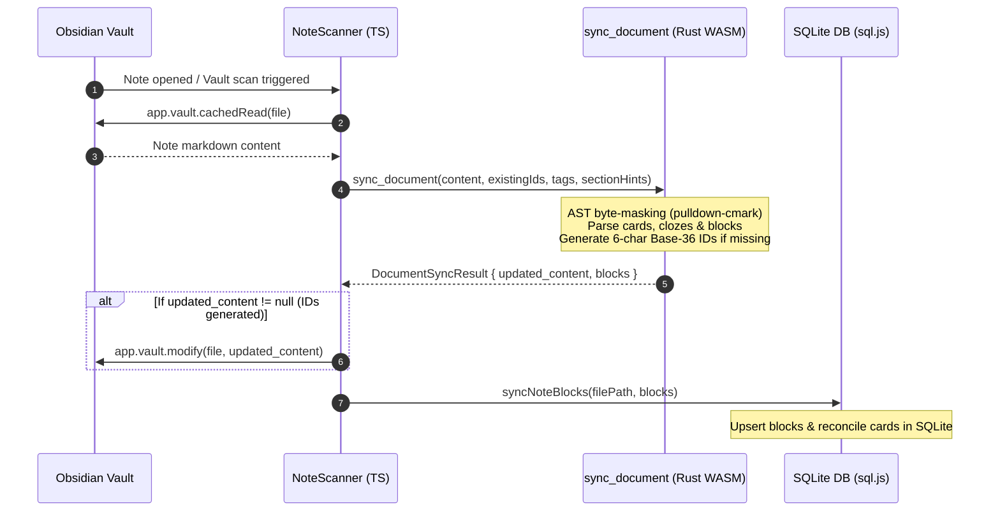
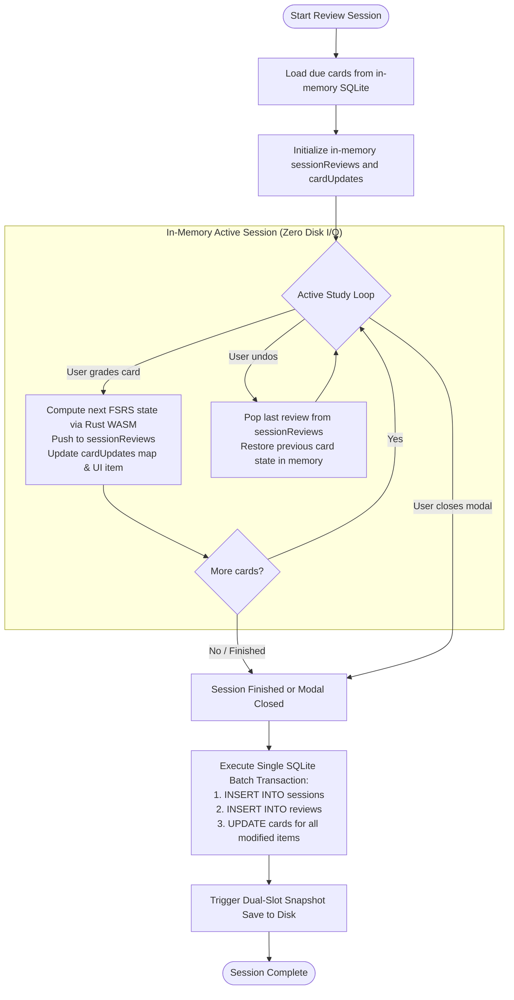
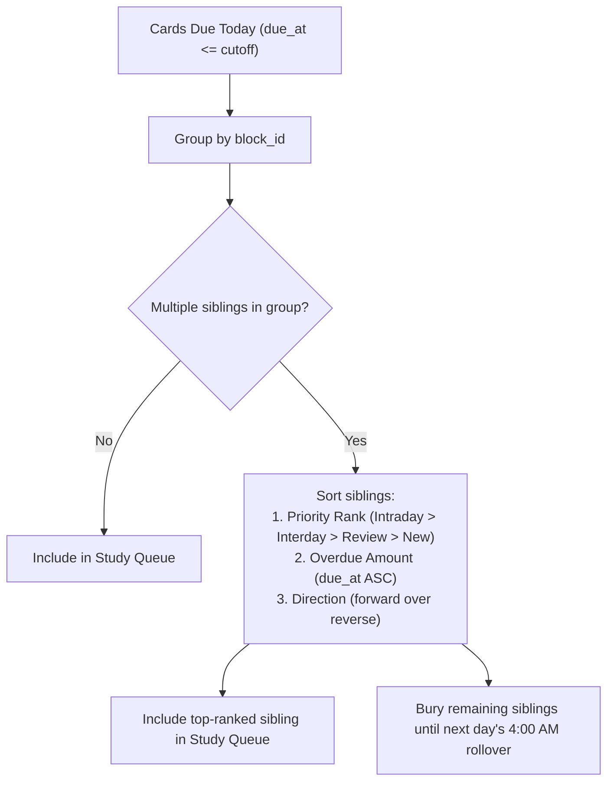
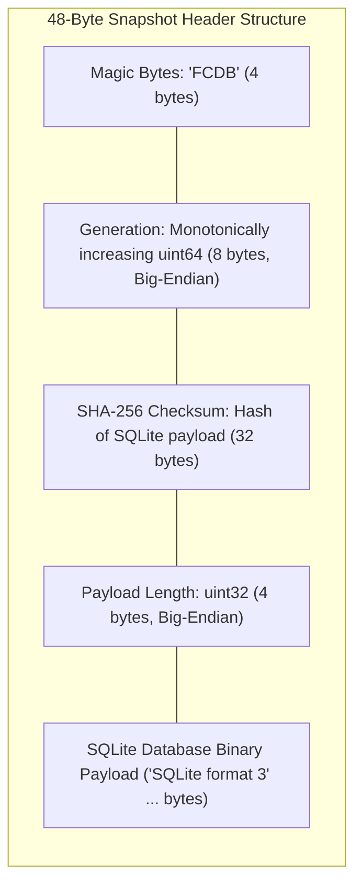
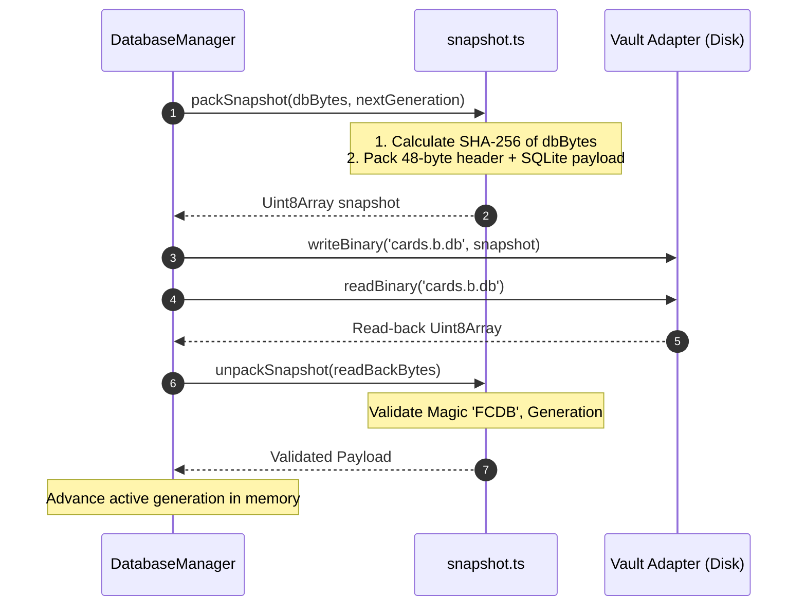

# Flashcards Plugin — Architecture Specification

**Status:** Current Architecture (v2)

## 1. Overview & Core Philosophy

The Flashcards plugin enables spaced repetition learning directly within Obsidian notes powered by a **Fat Rust Core** compiled to WebAssembly and a **Thin TypeScript Shell** for the Obsidian UI and storage.

### Core Principles
- **Markdown is the canonical source of truth**: Cards are defined directly in notes using clean, native Obsidian syntax. Notes contain only human-readable content and simple 6-character lowercase base-36 block IDs (`^k9x2mp`)—never timestamps, repetition metrics, frontmatter UUIDs, or scheduling metadata.
- **Zero Frontmatter Pollution**: Notes never require YAML frontmatter modifications or note UUIDs. The plugin only attaches IDs to flashcard blocks that need them.
- **Fat Rust Core (`crates/flashcards-wasm`)**:
  - Official `fsrs` crate from crates.io (`version 6.6.1`) for scheduling and on-device weight optimization.
  - AST-aware Markdown parser with `pulldown-cmark` offset events (protecting code blocks, math, tables, callouts).
  - In-Rust 6-character lowercase base-36 ID generation, deduplication, and single-pass note text transformation.
- **Thin TypeScript Shell (`plugins/flashcards`)**:
  - Obsidian UI views built in Svelte 5 with native Obsidian CSS design tokens.
  - In-memory SQLite runtime via `sql.js` for instant queries.
  - Obsidian vault API bridge (`cachedRead`, `modify`, `writeBinary`).
- **Projection Model (`Markdown` → `blocks` → `cards` → `reviews`)**:
  - **Markdown (Canonical Source of Truth)**: Cards authored in notes with 6-character lowercase base-36 block IDs (`^k9x2mp`).
  - **`blocks` table (Parsed Projection / Block Index)**: In-memory index of parsed markdown blocks, keyed by `id`.
  - **`cards` table (Scheduling Projection)**: Materialized FSRS study items (forward, reverse, cloze), linked to `block_id`.
  - **`reviews` table (Immutable Event Log)**: Append-only ledger of historical review grades and timestamp deltas.
- **In-Memory Review Cache (Hashcards Model)**:
  - Active review sessions modify an in-memory session cache. Undoing is an instant memory pop (0 SQL queries), and quitting mid-session discards changes cleanly.
  - Database writes are batched and committed in a single atomic transaction at the end of the session.
- **Dual-Slot Recoverable Snapshot Protocol (`cards.a.db` / `cards.b.db`)**:
  - Alternating slots with 64-bit generation numbers, SHA-256 payload integrity verification, and write-then-read-back confirmation.
  - Engineered for mobile and Syncthing realities where atomic POSIX `rename` or `fsync` are not guaranteed.
- **Native Markdown Rendering**:
  - Review cards render in Svelte 5 via Obsidian's official `MarkdownRenderer`, preserving LaTeX math, wikilinks, code blocks, callouts, and vault image attachments.
- **Strictly Manual / On-Demand Scanning**:
  - No parsing, document scanning, or database synchronization is ever attached to `vault.on('modify')`, `vault.on('create')`, or editor keystroke events.
  - Scanning is triggered strictly via explicit user commands (**`Scan current note`** and **`Scan entire vault`**) to guarantee zero editor interference, zero cursor jumping, and zero background disk/battery drain while writing notes.

---

## 2. Card Syntax in Markdown

### 2.1 Simple Forward Cards (Inline)
Single-line question and answer separated by `::` (with or without spaces) and a trailing 6-character lowercase base-36 block ID. Produces `reversible = false` (1 forward card in `cards`):
```markdown
Capital of Pakistan? :: Islamabad ^k9x2mp
```

### 2.2 Bi-directional Cards (Inline)
Single-line card separated by `:::`. Produces `reversible = true` (**one block** in `blocks` and **two independent cards** in `cards`: Forward: Q → A, Reverse: A → Q):
```markdown
Capital of Pakistan? ::: Islamabad ^k9x2mp
```

### 2.3 Block Cards (Multi-line)
Wrapped inside Obsidian comment markers `%% ... %%` so metadata is completely invisible in Reading View and Live Preview:
```markdown
%% card-start id=k9x2mp reversible=true %%
What are the largest cities of Pakistan? #todo/card

...

- Karachi
- Lahore
- Faisalabad
%% card-end %%
```
- **Attributes** (`key=val` on `card-start` line):
  - `id`: Unique 6-character lowercase base-36 block ID (`[0-9a-z]`).
  - `reversible`: `true` or `false` (default is `false` if omitted).
- **Divider**: Standalone line with `...` or `. . .` separating Front (Question) from Back (Answer).

### 2.4 Cloze Deletion Cards
Uses explicit `{{cloze}}` double curly brace syntax. All clozes in a card are revealed in-place:
```markdown
The capital city of Pakistan is {{Islamabad}} ^k9x2mp

The three largest cities of Pakistan are {{Karachi}}, {{Lahore}}, and {{Faisalabad}}. ^w7n3rk
```
- **Always Non-Reversible**: Cloze blocks strictly require `reversible = false` (`0`), and produce 1 card row with `direction = NULL`.
- **Why `{{...}}`**: Eliminates collisions with regular note highlights (`==highlight==`), standard across spaced repetition tools (Anki, RemNote), and easily parsed without ambiguity.
- **In-Place Seamless Reveal**:
  - **Question State**: Cloze spans are masked in-place as `[ ... ]` pills.
  - **Answer State**: The `[ ... ]` pill unmasks into a highlighted `<mark>` answer directly in-place.
- **Storage Efficiency**: The full sentence with `{{...}}` is stored in `blocks.front`; `blocks.back` is left as an empty string `""` to avoid database string duplication.

### 2.5 Parser Boundaries & Markdown Protection
Card syntax is parsed with AST source protection:
1. `pulldown-cmark` generates an eligibility byte mask over the document.
2. Inline code spans, fenced code blocks, display math, tables, blockquotes, callouts, raw HTML, and YAML metadata are strictly protected from matching card separators or cloze markers.
3. Non-card prose in notes is ignored gracefully without causing parser errors or aborting scans.

### 2.6 Tag Composition & `#todo/card` Mechanics
A block's effective tags are the union of its containing note's YAML frontmatter tags and any inline `#tags` found inside the block:

```markdown
---
tags: geography
---

Capital of United States :: Washington ^xyz101
<!-- Tags: geography -->

Capital of California :: San Francisco #cs ^xyz102
<!-- Tags: geography, cs -->

%% card-start id=xyz103 %%
Why is Silicon Valley called that? #silicon #todo/card

...

Because it's got that Silicon #chips ;)
%% card-end %%
<!-- Tags: geography, silicon, todo/card, chips -->
```

- **Tag Scope**: For block cards, all `#tags` appearing between `%% card-start %%` and `%% card-end %%` (in both front and back) are associated with the block.
- **`#todo/card` Toggle Mechanics (Hotkey <kbd>T</kbd> during review)**:
  - **Removal (Toggle Off)**: Searches and removes `#todo/card` wherever it appears in the block's text, normalizing whitespace.
  - **Addition (Toggle On)**:
    - **Inline & Cloze Cards**: Appended at the end of the line right before the `^<id>` block identifier (e.g. `Question :: Answer #todo/card ^xyz101`).
    - **Block Cards**: Appended at the **end of the question line/section** (e.g. `Why is X? #todo/card\n...\nAnswer` or `Q: Why is X? #todo/card\nAnswer`).
    - **Why Question Placement**: Tags must **never** be placed on the `%% card-start %%` comment line because Obsidian's native tag indexer and global search ignore tags enclosed inside Markdown comment brackets `%%`. Placing it in the visible question ensures it is indexed natively across Obsidian.

---

## 3. Identity Model & Lowercase Base-36 Block IDs

A card's global identity is derived entirely from its **Block ID**.



### Properties & Benefits:
1. **6-Character Lowercase Base-36 Space**:
   - Character set: `[0-9a-z]` (36 lowercase alphanumeric symbols).
   - Total space: $36^6 = 2,176,782,336$ (~2.17 billion combinations).
   - An in-memory live `existing_ids` Set check guarantees 100% collision-free generation during note scans.
2. **Native Obsidian Case-Folding Resolver Immunity**:
   - While Obsidian's block search/autocomplete UI displays case-distinct blocks, Obsidian's underlying link and embed resolver (`![[note#^anchor]]`) normalizes and folds block anchors case-insensitively.
   - Enforcing strictly lowercase Base-36 (`[0-9a-z]`) guarantees that every block link and embed in Obsidian resolves unambiguously to the exact card.
3. **Native Obsidian Aesthetic & Format**:
   - Matches Obsidian's native 6-character lowercase block-link identifier length and appearance (`^37066d` / `^k9x2mp`).
4. **No File Mutation Except ID Generation**:
   - The plugin only writes to a file when a flashcard block is missing a block ID or has a duplicate ID.
   - Frontmatter is never touched or created.
5. **Renames & Moves**:
   - When a note is renamed or moved to another folder, `blocks.file_path` is updated to the new path during the scan without affecting `block_id` or card review schedules.

---

## 4. SQLite Database Schema (`src/db/schema.sql`)

The canonical schema definition is maintained in [`src/db/schema.sql`](src/db/schema.sql) (using SQLite `STRICT` mode).

### 4.1 Relational Structure Overview



### 4.2 Schema Validation Rules & Triggers
1. **Cloze Blocks**: `CHECK (block_type != 'cloze' OR reversible = 0)` ensures cloze blocks can never be marked reversible.
2. **Direction Validation Triggers**:
   - `trg_cards_insert_validate_direction` & `trg_cards_update_validate_direction` enforce:
     - `cards.direction IS NULL` **if and only if** parent `block_type = 'cloze'`.
     - `cards.direction IN ('forward', 'reverse')` **if and only if** parent `block_type != 'cloze'`.
3. **Card Uniqueness**:
   `CREATE UNIQUE INDEX idx_cards_block_direction ON cards(block_id, ifnull(direction, 'cloze'));` guarantees exactly 1 forward card, 1 reverse card (if reversible), or 1 cloze card per block.

### 4.3 Timestamps (`due_at`, `reviewed_at`, `updated_at`)
All timestamps are stored as **Epoch Milliseconds (`INTEGER`)** with the `_at` suffix (`due_at`, `reviewed_at`, `started_at`, `ended_at`, `updated_at`):
- Directly matches JS `Date.now()`, `date.getTime()`, and Rust FSRS `DateTime::from_timestamp_millis()`.
- Fast Numeric Indexing: Integer comparisons (`WHERE due_at <= ?`) are optimal for B-Tree indexes.
- Timezone Invariance: Avoids string parsing ambiguities across timezones and Daylight Saving shifts.

---

## 5. Single-Pass Synchronization Flow



### Vault Scan Lifecycle
1. **Iterate Files via `cachedRead`**: For each markdown file in the vault, read cached content via `app.vault.cachedRead(file)`.
2. **Pass into Rust WASM (`sync_document`)**: Rust parses cards, masks AST, generates fresh 6-char lowercase base-36 IDs (checking against `existingIds`), and rebuilds the modified Markdown text in Rust.
3. **File Write (if modified)**: If `updated_content` is present, TypeScript calls `app.vault.modify(file, updated_content)` once.
4. **Incremental In-Memory DB Update**: Upsert `blocks` and reconcile `cards` into the in-memory SQLite database immediately per file, updating the live `existingIds` Set.
5. **Final Snapshot Persistence**: Once all files in the vault have completed scanning, execute a single snapshot save to disk via the **Dual-Slot Persistence Protocol**.

---

## 6. Review Workflow & In-Memory Session Cache

Active review sessions maintain an in-memory session cache to provide seamless undo and clean session aborts:



```

---

## 7. Anti-Priming Sibling Burying & Load Smoothing

To prevent artificial recall priming and avoid study burnout from review spikes, the plugin implements a dual-layer cognitive protection system:

### 7.1 Queue-Level Anti-Priming (Sibling Burying)
When multiple cards generated from the same Markdown block (e.g. `forward` and `reverse` of a bidirectional card `:::`) are eligible for review on the same day, the queue assembler (`DatabaseManager.getDueCards` and `applySiblingBurying`) enforces a strict **4-tier cognitive priority hierarchy**:

1. **Intraday Learning (Rank 4, Highest)**: Cards in short-term learning/relearning steps ($< 1\text{ day}$, e.g. 10m). **Never buried** to guarantee same-day memory trace consolidation.
2. **Interday Learning (Rank 3)**: Cards in multi-day learning steps ($\ge 1\text{ day}$, e.g. 1d). Prioritized over mature reviews to stabilize fragile memories.
3. **Review Cards (Rank 2)**: Mature cards with FSRS intervals. Prioritized over new cards to protect existing retention.
4. **New Cards (Rank 1, Lowest)**: Unstudied cards.



### 7.2 FSRS-6 Load Smoothing & Sibling Dispersion
Rather than blindly applying random jitter, the Rust WASM core (`calculate_load_balanced_interval`) acts as a **closed-loop load smoother**:

1. **FSRS Constrained Fuzz Window**:
   - Interval $< 2.5\text{ days}$: Exact integer (no fuzz).
   - $2.5 \le \text{Interval} < 7\text{ days}$: $\pm 1\text{ day}$ range.
   - $7 \le \text{Interval} < 30\text{ days}$: $\pm 15\%$ range ($[0.85 \times I, 1.15 \times I]$).
   - $\text{Interval} \ge 30\text{ days}$: $\pm 5\%$ range ($[0.95 \times I, 1.05 \times I]$).
2. **Load Balancing via Due Histogram**:
   The TypeScript shell passes a 90-day histogram of upcoming daily due counts from SQLite (`getUpcomingDueCounts`). Candidate days within the fuzz window are weighted:
   $$\text{Weight}(d) = \left(\frac{1}{\max(1, \text{due\_count}[d])}\right)^{2.15} \times \left(\frac{1}{d}\right)^3 \times \text{SiblingPenalty}(d)$$
3. **Inter-Day Sibling Dispersion**:
   If a sibling card has a scheduled future due date, candidate days close to the sibling are heavily penalized ($\Delta = 0 \implies 10^{-6}, \Delta = 1 \implies 0.20, \Delta = 2 \implies 0.40$), permanently dispersing siblings into distinct review cycles.

---

## 8. Dual-Slot Recoverable Persistence Protocol (`cards.a.db` / `cards.b.db`)

Obsidian mobile and desktop storage adapters do not expose POSIX `fsync` or guaranteed atomic file replacement on `rename`. Rather than assuming atomicity, the plugin uses a **Dual-Slot Alternating Snapshot Protocol**:

### 7.1 Slot Header Structure

Each snapshot file (`cards.a.db` and `cards.b.db`) starts with a fixed 48-byte header:



### 7.2 Write Lifecycle



1. Identify current active slot (e.g. `cards.a.db` with Generation 14).
2. Export in-memory SQLite buffer (`db.export()`) → payload `Uint8Array`.
3. Compute SHA-256 of the payload.
4. Prepare target slot `cards.b.db` with Generation 15 + SHA-256 + payload.
5. Write target file via `app.vault.adapter.writeBinary('.../cards.b.db', buffer)`.
6. **Read-Back Verification**:
   - Read back `cards.b.db` bytes from disk.
   - Verify Magic Bytes, Generation 15, and SHA-256 checksum match.
   - Verify SQLite header matches `SQLite format 3`.
7. Mark Slot B (Gen 15) as the active generation in memory.

### 7.3 Startup Recovery Lifecycle
1. On plugin `onload()`, attempt to read both `cards.a.db` and `cards.b.db`.
2. Validate header, generation, and SHA-256 checksum for both files:
   - **Both Valid**: Load the slot with the **higher generation number** (Gen_B > Gen_A).
   - **One Corrupt** (e.g. power cut mid-write of slot B): Slot A remains completely intact and valid; automatically load Slot A.
   - **Neither Valid** (First installation): Initialize a fresh, empty SQLite schema from `schema.sql`.

---

## 8. UI Architecture & Native Obsidian Design System (Svelte 5)

The study interface uses a **focused 3-tier layout** built in Svelte 5 with official Obsidian design tokens:

```
┌────────────────────────────────────────────────────────────┐
│ [Undo]         Breadcrumb & Slim Progress Line        [End]│ Top Bar
├────────────────────────────────────────────────────────────┤
│                                                            │
│   Centered Card Canvas                                     │
│   ┌────────────────────────────────────────────────────┐   │
│   │ Note Title                               Reverse   │   │
│   │ ────────────────────────────────────────────────── │   │
│   │ Front Question / In-place Cloze                    │   │
│   │ ────────────────────────────────────────────────── │   │
│   │ Back Answer (revealed on flip)                     │   │
│   └────────────────────────────────────────────────────┘   │
│                                                            │
├────────────────────────────────────────────────────────────┤
│ [Back]        [   Forgot   ]    [  Remembered  ]     [Next]│ Bottom Bar
└────────────────────────────────────────────────────────────┘
```

### 9.1 Review Modal (3-Tier Canvas Layout)
1. **Top Header**:
   - **`[Undo]`**: Reverts previous rating from in-memory session stack (<kbd>Ctrl+Z</kbd> / <kbd>U</kbd>).
   - **Breadcrumbs & 4px Progress Track**: Minimal deck label with current card counter and thin progress fill.
   - **`[End]`**: Saves session state and exits modal (<kbd>Esc</kbd>).
2. **Centered Card Canvas**:
   - Centered card (`max-width: 760px`) styled with `var(--background-primary)`, `var(--radius-l)`, `var(--shadow-l)`.
   - High legibility clamp typography (`clamp(1.15rem, 2vw, 1.35rem)`) with `line-height: 1.6`.
   - In-place cloze unmasking (`.fc-cloze-mask` $\to$ `.fc-cloze-revealed` using `var(--text-accent)`).
3. **Docked Bottom Action Bar**:
   - **Queue Navigation**: `[Back]` (<kbd>←</kbd>) and `[Next]` (<kbd>→</kbd>) allow browsing through the queue without altering card scheduling.
   - **Assessment Actions**:
     - *Unrevealed*: Dominant `[Show Answer]` (<kbd>Space</kbd> / <kbd>Enter</kbd>).
     - *Revealed*: `[Forgot]` (Left half, <kbd>F</kbd> / <kbd>1</kbd>) and `[Remembered]` (Right half, `mod-cta`, <kbd>Space</kbd> / <kbd>3</kbd>).

### 9.2 Streamlined Completion Screen
Displays motivational feedback and session metrics upon finishing all due cards:
- **Summary**: *"Reviewed X cards in Y seconds."*
- **Stats Grid**: Cards Studied, Retention Rate (%), Pace (s/card), Total Duration.

### 9.3 Dashboard View (Metric Bar, Token-Based Table & Block Grouping)
- **Top Overview Metric Bar**: Displays four core operational stats (`Studied today`, `Retention`, `🔥 Streak`, `Total cards`) and quick CTA launch buttons (`Study all (X due)` and `Study deck`).
- **1:1 Block Row Grouping (`groupCardsByBlock`)**: Consolidates bidirectional cards into a single Markdown block row displaying the primary forward Question and Answer. Independent reverse scheduling metrics sit directly underneath in a muted `⇄` sub-row under **Due**, **Reviews**, and **Last Practiced**.
- **Interactive Toolbar & Table Filters**: Filter pills (`All`, `Due today`, `New`, `Learning`, `Review`) and real-time search box (`note` text or `#tag`). Filter pill counts accurately reflect matching table rows.
- **Obsidian Design Tokens**: Strict reliance on native Obsidian table variables (`--table-border-color`, `--table-header-background`, `--table-row-alt-background`, `var(--font-ui-small)`, `var(--font-bold)`).

### 9.4 Tag Picker Modal (Hashcards-Inspired Deck Stats Table)
- **Compact Deck Statistics Table**: Lists all tag decks with detailed columns for `[Tag]`, `[Due]`, `[New]`, and `[Total]` (`computeTagDeckStats`).
- **Active Deck Sorting & Visual Contrast**: Automatically sorts active/due decks to the top. Due counts highlight in theme accent color (`var(--text-accent)`), while zero counts are muted in `var(--text-faint)`.
- **Multi-Deck Queue Assembly**: Checkbox selection and row toggling allow assembling a custom multi-tag study queue, with a dynamic action button indicating total workload (`[ Study selected (X due • Y total) ]`).
- **Interactive Column Sorting**: All table headers support bidirectional sorting (`Tag`, `Due`, `New`, `Total`).

### 9.5 Right-to-Left (RTL) & Bidirectional Typography Support
- **Logical CSS Properties**: Interface layouts, margins, paddings, and table alignments strictly utilize logical properties (`margin-inline-start`, `text-align: start`, `text-align: end`, `inset: 0`) ensuring native horizontal mirroring when `.mod-rtl` is active on `body`.
- **Bidirectional Content Isolation (`unicode-bidi: plaintext` & `dir="auto"`)**: All single-line user-authored texts (note titles, breadcrumbs, tags, text previews, search inputs) specify `unicode-bidi: plaintext` and `dir="auto"` to prevent character reordering, punctuation flipping, and ellipsis (`…`) truncation anomalies across mixed LTR/RTL notes.

---

## 10. Registered Commands

| Command Name | Scope | Description |
| :--- | :--- | :--- |
| **`Flashcards: Study all cards`** | Global | Launches review queue for all due cards across the vault. |
| **`Flashcards: Study deck`** | Global | Opens Tag Picker prompt to select tags and launches filtered review. |
| **`Flashcards: Open dashboard`** | Global | Opens the Flashcards Inventory & Scheduling dashboard tab. |
| **`Flashcards: Scan current note`** | Editor | Scans active note, auto-assigns missing IDs, syncs tags, and updates SQLite. |
| **`Flashcards: Scan entire vault`** | Global | Scans all notes across the vault, auto-assigns missing IDs, and saves snapshot. |
| **`Flashcards: Insert card block`** | Editor | Inserts clean `%% card-start %%\n\n...\n\n%% card-end %%` template at cursor. |
| **`Flashcards: Optimize FSRS weights`** | Global | Runs FSRS-6 optimizer over `reviews`, updates custom weights in settings. |
| **`Flashcards: Optimize database`** | Global | Runs `PRAGMA integrity_check`, deletes orphaned rows, executes `VACUUM`. |

---

## 11. Plugin Settings (`data.json`) & Configuration

Sparse configuration in `<vault>/.obsidian/plugins/flashcards/data.json` (only user overrides are stored):

| Setting | Type | Default | Description |
| :--- | :--- | :--- | :--- |
| **Desired retention** | Number (%) | `90` (90%) | Target retention rate (0.80 - 0.99, mapped to `request_retention: 0.90`). |
| **Maximum interval** | Number (days) | `36500` (100 years) | Maximum interval cap in days. |
| **Learning steps** | String | `10m 1d` | Space-separated durations for new cards (`m`=minutes, `h`=hours, `d`=days). |
| **Relearning steps** | String | `10m` | Space-separated durations after lapsed/forgot cards. |
| **Weights** | String | `""` (empty) | Custom 21 FSRS weights `w`. Empty uses FSRS-6 defaults. |
| **Interval fuzz** | Boolean | `true` | Toggle small random variations to prevent review clustering. |
| **Next day starts at** | Number (hours) | `4` (4:00 AM) | Rollover hour past midnight for due queue and daily streak calculations. |

---

## 12. Directory Structure

```
crates/flashcards-wasm/
├── Cargo.toml
├── src/
│   ├── fsrs.rs          # FSRS-6 core scheduling engine, load balancing & item calculations
│   ├── lib.rs           # WebAssembly exports with Fallible<T> / fail()
│   ├── markdown.rs      # pulldown-cmark AST byte-masking
│   ├── optimizer.rs     # On-device weight training over review logs
│   ├── parser.rs        # Single-pass sync_document & block extraction
│   ├── parser_tests.rs  # Unit tests for parser and transformer
│   ├── syntax.rs        # Base-36 ID generation & cloze parsing
│   └── types.rs         # Domain types & Serde serializers
└── fuzz/
    └── fuzz_targets/parse.rs # libFuzzer target for sync_document

plugins/flashcards/
├── manifest.json
├── package.json
├── tsconfig.json
├── src/
│   ├── main.ts              # Lightweight plugin lifecycle & commands (<300 lines)
│   ├── settings.ts          # Settings tab & FSRS optimizer UI
│   ├── types.ts             # TypeScript interfaces matching schema.sql
│   ├── wasm.ts              # WASM bridge loader & typed wrappers
│   ├── db/
│   │   ├── DatabaseManager.ts # SQLite queries & card reconciliation
│   │   ├── schema.sql         # Canonical STRICT SQLite schema
│   │   └── snapshot.ts        # 48-byte header packing & SHA-256 verification
│   ├── scanner/
│   │   └── NoteScanner.ts     # Single-pass vault & note scanner
│   ├── ui/
│   │   ├── DashboardView.ts   # Inventory & stats leaf view
│   │   ├── ReviewModal.ts     # Review modal shell & in-memory session
│   │   ├── TagPickerModal.ts  # Deck/tag selector modal
│   │   └── components/
│   │       ├── DashboardView.svelte
│   │       ├── ReviewModal.svelte
│   │       └── TagPickerModal.svelte
│   └── utils/
│       ├── dashboardCards.ts     # Block grouping & reverse metrics consolidation
│       ├── dashboardFilter.ts    # Tag matching & text search filters
│       ├── reviewMetrics.ts      # Progress & retention calculations
│       ├── ReviewSessionCache.ts # In-memory session cache & undo stack
│       ├── siblingBurying.ts     # Anti-priming priority ranking & queue filtering
│       ├── studyDay.ts           # 4:00 AM rollover & streak date calculations
│       ├── studySteps.ts         # Duration string parsing
│       ├── tagStats.ts           # Tag deck statistics aggregation
│       └── todoTag.ts            # #todo/card tag toggling in Markdown
└── tests/
    └── flashcards.test.ts        # Vitest unit test suite (67 tests)
```
